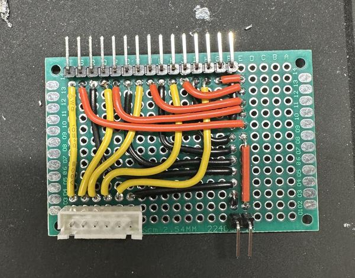
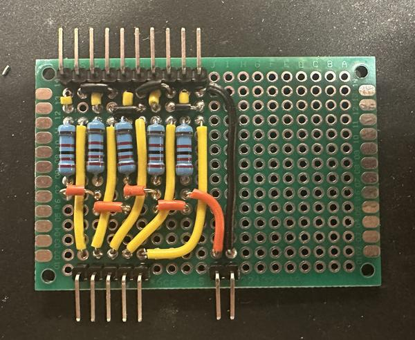

# Origin of the project 

The genesis of this independent project was when I was approached by the head of my high school to see if I could make a robotic hand to be “Thing” in our school’s spring musical, the Addams Family. Having a decent knowledge of robotics, computer science and electrical work from working on the robotics team and making other projects, this was an interesting challenge for me. I began to research online and found that there were no commercially made hands and no hands that could be rented. The best robotic hand I saw online was made as a promotion for the Netflix series Wednesday, but it took a professional special effects studio with a team of six people five months to make it. 

After researching different options, I decided to make a robotic hand that would mirror my own hand movements while wearing a glove equipped with sensors. I found someone online who had made an arduino flex-sensor controlled robotic hand. The youtube video I used for inspiration can be found [here](https://www.youtube.com/watch?v=Fvg-v8FPcjg)

# Core Materials

Arduinos are small programmable computers that are cheap and easy to use for small projects like this one. Initially I was using a regular ESP-32, but because they do not have a screen or a battery, it would not have been possible to make Thing wireless. I decided to use the Heltec WiFi LoRa 32 (V3) because it is smaller than a regular Arduino (1” x 0.5”), it has a USB C charging port, a rechargeable battery, WiFi, Bluetooth, and an LED screen. 

The second core component of this project are the flex resistors which are long strips that increase resistance as they are bent. They have little electrical resistance (ohms) when they are straight, but the more they are flexed, the greater the resistance. 

The store page to buy these is [here](https://www.spectrasymbol.com/resistive-flex-sensors)

Another important component are the servos, a great staple of any electronics project.

These servos can be bought [here](https://tinyurl.com/rhu3s3ph)

The servos I used are very small motors that can turn 180 degrees. I needed them to be small because the idea was that they would fit inside the hand eventually, and I wanted the hand to be a normal size. Servos interface easily with Arduino, and they are easy to code. I used five servos, one for each finger. 

# General Design of the Hand 

The design shown in the above video has a good base, but had a lot of issues I wanted to resolve in my final design. Notably, it used a wired connection meaning that it would not be able to move far from the person controlling it. As a proof of concept this is perfectly fine, but for the play I wanted Thing to be wireless in order to move from one side of the stage to the other seamlessly. To make this possible I planned to use two Arduinos to communicate with each other over WIFI.

To start prototyping the servo movement code with the Arduinos, I got a small robotic hand with servos from amazon. This hand was much too small to use as a final product but it was good to use for testing.  

Servo motors have a set range of motion (0 to 180). In the code, I put the value that I was setting the servo to in a loop. I started testing the servos by incrementing them and checking both extremes. **VIDEO OF SERVO SWEEP TESTS**

Then I learned about how the WIFI communication system worked between the two Arduinos and repeated the same test. One of the Ardinuos is sending the desired angles to the other one which forwards those commands to the servo and sends it to the desired position. 

Next I made a basic PCB (printed circuit board) so that I could test multiple servos at once in a more streamlined fashion. Each servo needs three wires to function: the power IN (red), the ground which completes the circuit (black), and the signal wire which tells the servo what angle to be at (yellow). In order to make the PCB, I first planned out the routes that I needed the wires to make, counted the pins that I needed going in, and measured the distances of the wires and cut them accordingly. I soldered the wires to the board, made the connections between the (little circles on the board), and used a multimeter to check that each wire was running to where it was supposed to. In the picture below, the top row of pins all go to the servos (5 servos means 15 pins). All of the wires connect to the pins in a sequence: yellow, red, black, yellow, red, black…). In the bottom left, the signal wires go into a ribbon cable connection which connects to the Arduino so that it can control each servo. I had to crimp a female connection onto the ends of the ribbon cable so that it would connect to the male pins on the arduino. The arduino is able ​​to differentiate each servo by the pin number that it is connected to. In the bottom right, the two pins are connected to a small battery pack of AA batteries that provides both the power and ground for the circuit.

The hand itself and the fingers are all very similar to what was used in the previously mentioned Youtube video. Each finger is separated into three segments (with the thumb being only two segments). Each segment has three holes in it (two of which are larger than the third) and an elastic string is threaded through the holes to hold the fingers together. The elastic string ties off at the tip of each finger and the knuckle at the base of the finger. The elastic string is what is holding the hand together and what keeps the hand upright when the servos are in their “up” position. The tension of the elastic is also what brings the fingers of the hand back up when the servos release to their “up” position. The smaller hole is used for dental floss (fishing line was tried but found to be too stretchy and smooth which resulted in the line detaching from the servos) which connects at the tip of each finger, runs down the inside of the finger through to the palm. The floss is then tied to the servos so that when a servo moves downwards, it will pull on the floss and therefore pull the corresponding finger down. 

 

These photos show an early prototype 3D printed hand. On the left you see the fishing wire running through and out the bottom of the hand. On the right you can see the black elastic string running through and tied off at the base of the fingers.

The next steps were to figure out a way to mount the servos inside the wrist portion of the hand. The servos needed to fit in a way where their movement arcs would not intersect with one another. In the video I used for inspiration the person doing the project decided to glue the servos to the 3D print but I did not like the idea of that so I decided to make something more permanent. I used metal inserts that can be pressed into the 3D print which allowed me to screw the servos down. I used a special tip for the hot soldering iron to melt the plastic and press the insert into it.

 

I changed over to a skin tone color for the 3D print. On the left is an initial servo layout that I tested, but ultimately decided that it did not fit well. 

In order to make the Arduino, circuit board, servo motors, and batteries fit inside the casing I made a new circuit board and changed the layout of the battery pack. The new circuit board had connections so that the Arduino could plug in to the board directly with no wires in between. The battery pack I changed to a flat one where 4 AA batteries are laid parallel to one another and then recessed into the bottom of the housing. This allows for easy access to change out the batteries, adds weight to the bottom to prevent tipping, and is compact so it does not get in the way of other parts. Additionally, there is a small, rechargeable LIPO battery that powers the arduino. The larger battery pack powers the servos in conjunction with the smaller one to make the system work. For ease of use I also added a switch for the power battery wires. It is a DPDT switch with one throw wired in to cut off or allow the flow of power without having to take off the casing to turn it on. I also added a thumbscrew to the casing with a threaded insert to easily access the interior of the hand. I implemented a similar design with the back plate that the servos screw into so that the whole layout could be removed for easy access and servicing. 

 

The new board shown on the left is functionally the same as the previous one but without the ribbon cable connection so as to cut down on space. The image on the right shows the recessed battery pack, silver thumb screw on the left and the power switch on the top left above the Arduino.

The ranges of the values of the flex resistors were too large  so I used a voltage divider to help balance it out. The signal wires are reading from the voltage after the resistor. 

I designed an arm piece that would strap to my arm using velcro and would hold an arduino and a battery. It could then read the resistance values from each flex resistor and then send it to the other arduino inside the hand. The arduino in the hand then uses these values to move the servos and make the fingers match how mine are moving in the glove. 

I bought an outdoor work glove and 3D printed guide rails for the flex resistors so that they would stay in a uniform position on each of my fingers. I sewed these guide rails into the outdoor work glove. I also sewed the base of each flex resistor to the base of each finger on the glove. After a few days of play rehearsals which was heavy testing for the glove and the hand, I noticed that the flex resistors values would no longer reflect the originals that we set. I had to hold my fingers and the resistors at awkward angles just to get to the original positions. Sometimes, even that would not work. After some research online, it became clear to me that the resistors’ degradation was a known problem. Therefore, I decided to make a new glove, and on this new one I would sew down the base of each resistor much more than I had on the first glove. 

All of the programming files can be found below and are fully commented. When running the hand, first I plugged in the battery for the glove arduino, and it starts to look for a specific WIFI network with a specific name and would try the password that we gave it. The Arduino in the hand acts as a WIFI network and the one in the glove works as a WIFI client. This allows the two devices to communicate and send messages to one another. In this case I am using the glove Arduino to record the values of the flex resistors then scale those values to a number between 0 and 180 relative to the resistor’s minimum and maximum. The glove Ardunio then takes that number and the resistor number and sends the hand Ardunio a message in this format: “[resistor number] [desired angle]”. The resistor number corresponds to the servo controlling the same finger which the hand Ardunio sets to the desired angle after receiving the message. Both Arduinos display the values and the resistor number on their OLED screens in a scrolling format. The next value is displayed at the bottom and the preceding ones are shifted up to help with debugging to ensure all the values are expected as well as all the resistors are responsive. The code for this can be found in the text scrolls file. The code for the hand can be found in the 5 servo access point file. The code for the glove is found in the 5 servo client file. 

